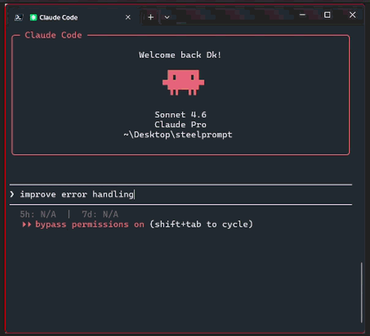

<picture>
  <source media="(prefers-color-scheme: dark)" srcset="../assets/banner-dark.svg">
  
</picture>

<div align="center">

🌐 [English](../README.md) · [中文](README.zh.md) · [Español](README.es.md) · [PT-BR](README.pt-BR.md) · [日本語](README.ja.md) · **한국어** · [Deutsch](README.de.md) · [Français](README.fr.md) · [Italiano](README.it.md)

[](https://github.com/bhutano/steelprompt)
[](https://github.com/bhutano/steelprompt/blob/master/LICENSE)
[](https://python.org)
[](https://claude.ai/code)



**모든 프롬프트를 Anthropic의 7가지 공식 원칙으로 재구성 — Claude Code에서는 자동으로이고서 Claude.ai에서는 필요할 때.**

✦ API 키 불필요 · ✦ Claude Code + Claude.ai 웹 · ✦ 추가 지연 없음 · ✦ 4가지 전환 가능한 모드

</div>

---

## 문제

Claude의 효과는 주어진 프롬프트의 품질에 달려 있습니다. 대부분의 프롬프트에는 역할 지정, 구조화된 맥락, 명시적 제약 조건, 출력 형식 사양, 예시가 빠져 있습니다 — 이 모두는 Anthropic의 공식 가이드라인이 응답 품질을 크게 향상시킨다고 명시한 요소들입니다.

매 프롬프트를 수동으로 10분씩 엔지니어링하거나, steelprompt를 사용하면 됩니다 — Claude Code에서는 자동으로이고서 Claude.ai에서는 필요할 때.

---

## 작동 방식

steelprompt은 두 가지 환경에서 작동합니다:

- **Claude Code (CLI)** — `UserPromptSubmit` 훅이 Claude가 처리하기 전에 모든 프롬프트를 자동으로 가로책니다.
- **Claude.ai (웹)** — `prompts/steelprompt-web.md`를 사용자 지정 지침에 한 번 붙여넣은 후, `/sp "프롬프트"`를 사용하여 필요할 때 프롬프트를 엔지니어링하세요.

두 경우 모두 동일한 3단계 결정 프로토콜이 적용됩니다:

```
입력한 프롬프트
    │
    ▼
┌─────────────────────────────────────────────────┐
│  단계 1 — 우회                                  │
│  슬래시 명령 · 5단어 미만 · 단순 작업          │
│  → 변경 없이 그대로 전달                        │
└─────────────────────────────────────────────────┘
    │ 우회되지 않음
    ▼
┌─────────────────────────────────────────────────┐
│  단계 2 — 질문                                  │
│  중요한 정보가 빠져 있나요?                     │
│  → AskUserQuestion (1~2개의 핵심 질문)          │
└─────────────────────────────────────────────────┘
    │ 프롬프트가 명확함
    ▼
┌─────────────────────────────────────────────────┐
│  단계 3 — 프레임워크 적용       ← 기본값        │
│  7가지 Anthropic 원칙으로 재구성               │
│  Claude가 응답하기 전에 자동으로 처리          │
└─────────────────────────────────────────────────┘
```

외부 API 호출 없음. Claude가 일반 추론 과정에서 인라인으로 재구성합니다 — 추가 지연 없음, 추가 토큰 청구 없음.

---

## 단계 3 실제 예시

이것이 steelprompt의 핵심입니다. 명확하고 단순하지 않은 모든 프롬프트가 자동으로 여기를 통과합니다.

**입력:**
```
add rate limiting to the auth endpoints
```

**steelprompt가 내부적으로 주입하는 내용** (`preview` 모드에서 실행 전에 확인 가능):
```
You are a senior backend security engineer.

<context>
Project: Express.js API with JWT authentication
Endpoints affected: POST /auth/login, POST /auth/refresh, POST /auth/register
Environment: Node.js 20, existing middleware stack in src/middleware/
Known constraints from conversation: Redis already in use for session storage
</context>

<task>
Implement rate limiting on authentication endpoints:
1. Add per-IP rate limiting: max 5 requests/minute on /login and /register
2. Add per-user rate limiting: max 20 requests/hour on /refresh
3. Return 429 with Retry-After header on limit exceeded
4. Do not affect non-auth endpoints
</task>

<constraints>
- Reuse existing Redis connection, do not introduce a new client
- Do not modify JWT validation logic
- Rate limit state must survive server restarts
- Follow existing middleware patterns in src/middleware/
</constraints>

<output_format>
1. New middleware file with implementation
2. Diff showing changes to auth routes
3. Two Jest test cases: limit hit + normal flow
</output_format>

Think through this step by step before answering.
```

**Claude가 생성하는 결과:** 테스트를 포함한 완전한 프로덕션 수준의 구현 — 속도 제한 옵션에 대한 일반적인 개요가 아닙니다.

---

## 고급 패턴

steelprompt는 전체 Anthropic 문서에서 가져온 5가지 상황별 패턴으로 7가지 핵심 원칙을 확장합니다 — 프롬프트에서 해당 패턴이 감지되면 자동으로 적용됩니다:

### 체인 감지

작업이 여러 순차적 작업에 걸쳐 있을 때, steelprompt는 체인을 감지하고 실행 전에 계획을 보여줍니다.

**입력:**
```
auth.py 리팩터링하고, 테스트 추가하고, 문서 업데이트해줘
```

**steelprompt가 다단계 체인을 감지하고 확인을 위해 일시 중지합니다:**
```
Chain detected (3 prompts):
→ Prompt 1: Refactor auth.py following SOLID principles
             Produces: refactored auth.py
→ Prompt 2: Write pytest tests for the refactored code
             Uses: output of Prompt 1
→ Prompt 3: Update docs/auth.md
             Uses: output of Prompt 1 + 2
```

그런 다음 묻습니다: **순차 실행 · 단일 프롬프트로 실행 · 취소**

---

### 에이전트 안전성

작업에 되돌릴 수 없는 작업이 포함된 경우, steelprompt가 자동으로 안전 제약 조건을 주입합니다.

**입력:**
```
프로덕션 데이터베이스에서 모든 오래된 레코드를 삭제해줘
```

**steelprompt가 `<constraints>`에 자동으로 추가합니다:**
```
- Show COUNT of affected rows before executing DELETE
- Scope: only rows matching the explicit filter condition
- Require explicit confirmation before the irreversible action
- Do not touch tables or columns not explicitly mentioned
```

---

### 긴 컨텍스트 순서

작업이 긴 파일이나 문서를 참조하는 경우, steelprompt는 그것들을 `<context>` 안의 작업 설명 **앞에** 배치합니다 — 긴 데이터는 쿼리보다 먼저 와야 한다는 Anthropic의 가이드라인에 맞게.

| steelprompt 없이 | steelprompt 사용 시 |
|---|---|
| `<task>` 먼저, 그 다음 파일 내용 | 파일 내용이 `<context>` 안에서 먼저, 그 다음 `<task>` |

---

### 중요 형식의 프리필

출력 형식이 엄격하게 중요한 경우(JSON, YAML, SQL), steelprompt는 프리필 앵커를 추가합니다: 첫 번째 토큰부터 Claude를 올바른 형식으로 고정하기 위해 시작 문자(`{`, `---`, `SELECT`)로 응답을 시작합니다.

```
입력: "이 설정 파일을 파싱해서 JSON으로 반환해줘"
steelprompt가 <output_format>에 추가: { 로 응답 시작
```

---

### 부정적 예시

올바른 출력 형식이 명확하지 않은 모호한 작업의 경우, steelprompt는 `<example>` 블록 옆에 `<bad_example>` 블록을 생성합니다 — **생성하지 말아야 할** 것을 보여주면 형식에 민감한 작업의 환각을 줄입니다.

```
<example>
Input: user object → Output: {id, name, email} (no password field)
</example>
<bad_example>
Input: user object → Output: {id, name, email, password_hash} ← never expose this
</bad_example>
```

---

## 단계 2 실제 예시

중요한 정보가 누락된 경우, steelprompt는 추측하기 전에 묻습니다.

| 입력 | steelprompt가 묻는 것 |
|---|---|
| `"코드 개선해줘"` | 어떤 파일인가요? 어떤 종류의 개선 — 가독성, 성능, 정확성? |
| `"버그 고쳐줘"` | 어떤 버그인가요? 재현 단계나 오류 메시지가 있나요? |
| `"auth 리팩터링해줘"` | 목표가 무엇인가요? 공개 API인가요, 내부용인가요? 동작이 동일하게 유지되어야 하나요? |
| `"아이콘 색상을 빨간색으로 변경해줘"` | *(단계 1 — 단순 작업, 직접 응답)* |

---

## 모드

| 모드 | 동작 |
|---|---|
| `full` (기본값) | 3단계 프로토콜 활성: 우회 → 질문 → 7가지 Anthropic 원칙 적용 |
| `preview` | 실행 전 엔지니어링된 프롬프트 표시 — 검토, 편집 또는 취소 |
| `ask-only` | 명확화 질문만 수행; 전체 프레임워크 적용 안 함 |
| `off` | 훅 완전히 비활성화 |

```bash
/steelprompt mode full
/steelprompt mode preview
/steelprompt mode ask-only
/steelprompt mode off
```

설정은 `$CLAUDE_PLUGIN_ROOT/.steelpromptrc`에 사용자별로 저장됩니다. 설정 없음 = 기본값 `full`.

---

## 미리 보기 모드

실행 전에 엔지니어링된 프롬프트를 보고 싶으신가요? `preview`로 전환하세요:

```
/steelprompt mode preview
```

그런 다음 평소처럼 프롬프트를 입력하세요. Claude가 자동으로 응답하는 대신, 재구성된 프롬프트를 보여주고 **실행 · 편집 · 취소**를 묻습니다.

---

## 수동 스킬: `/steelprompt`

프롬프트를 수동으로 엔지니어링하거나 모드를 전환할 때 사용합니다.

```
/steelprompt "users 테이블에 소프트 삭제를 추가하는 마이그레이션"
```

**출력:**
```
You are a senior database engineer specializing in PostgreSQL migrations.

<context>
Project: Rails 7 application with PostgreSQL
Table: users (id, email, created_at, updated_at)
Migration system: ActiveRecord
Known constraints: zero-downtime deployment required, table has ~2M rows
</context>

<task>
Add soft delete support to the users table:
1. Add deleted_at timestamp column (nullable, default null)
2. Add index on deleted_at for query performance
3. Update User model with default_scope excluding deleted records
4. Add User#soft_delete and User#restore methods
</task>

<examples>
<example>
Input: User.destroy(42)
Output (after): sets deleted_at = now(), does not DELETE the row
</example>
<example>
Input: User.all
Output (after): returns only records where deleted_at IS NULL
</example>
</examples>

<constraints>
- Do not use a gem (acts_as_paranoid, discard) — implement directly
- Migration must be reversible (down method required)
- Do not alter existing indexes or foreign keys
- Keep existing hard-delete path available via User.unscoped.destroy
</constraints>

<output_format>
1. Migration file with up/down
2. Model changes (3–5 lines max)
3. Two unit tests: soft delete sets column, default scope excludes deleted
</output_format>

Think through this step by step before answering.
```

---

## 설치

```bash
claude plugin marketplace add bhutano/bhutano-marketplace
claude plugin install steelprompt
```

**요구 사항:** Claude Code 2.0.22+ · Python 3.8+

```bash
claude --version   # Claude Code 버전 확인
python --version   # Python 버전 확인
```

---

## Claude.ai (웹)에서 사용하기

Claude Code를 사용하지 않으시나요? [claude.ai](https://claude.ai)에서 바로 동일한 프롬프트 엔지니어링 프레임워크를 사용할 수 있습니다 — 설치 불필요, CLI 불필요.

**설정 (한 번만):**
1. 브라우저에서 [claude.ai](https://claude.ai) 열기
2. 프로필 아이콘 클릭 → **설정** → **프로필**
3. **"사용자 지정 지침"** (또는 *"Claude가 어떻게 응답하길 원하시나요?"*) 찾기
4. [`prompts/steelprompt-web.md`](https://raw.githubusercontent.com/bhutano/steelprompt/master/prompts/steelprompt-web.md) 내용을 복사하여 붙여넣기 → 저장

완료. Claude.ai에서 작성하는 모든 프롬프트는 Claude가 응답하기 전에 동일한 3단계 프로토콜로 자동 재구성됩니다.

**수동 트리거:** `/sp "프롬프트"` · **미리보기 모드:** `/sp mode preview`

> 웹 버전에는 훅이나 도구 호출이 없습니다 — Claude.ai의 네이티브 사용자 지정 지침 내에서 시스템 프롬프트로 실행됩니다.

---

## 우회

steelprompt는 다음을 절대 가로채지 않습니다:

| 접두사 | 동작 |
|---|---|
| `/command` | 슬래시 명령은 변경 없이 그대로 전달 |
| `* prompt` | 명시적 우회 — 이 프롬프트 건너뜀 |
| `# prompt` | 명시적 우회 — 이 프롬프트 건너뜀 |
| 5단어 미만 | 단순 작업으로 처리 — 직접 응답 |

---

## 7가지 Anthropic 원칙

steelprompt는 우회되지 않은 모든 명확한 프롬프트에 이를 적용합니다:

| # | 원칙 | 적용 방식 |
|---|---|---|
| 1 | **역할** | `You are a senior [domain] engineer...` |
| 2 | **맥락** | `<context>` — 작업 전 모든 관련 배경 정보; 긴 파일/문서는 작업 설명 **앞에** `<context>` 안에 배치 |
| 3 | **작업** | `<task>` — 명령형 어조, 다단계 작업의 번호 매긴 단계 |
| 4 | **제약 조건** | `<constraints>` — 하지 말아야 할 것, 한계, 스타일 규칙; 파괴적 작업에는 에이전트 안전 제약이 자동 주입 |
| 5 | **출력 형식** | `<output_format>` — 정확한 구조, 길이, 섹션; JSON/YAML/SQL의 프리필 문자 앵커 |
| 6 | **사고 연쇄** | `Think through this step by step before answering` |
| 7 | **예시** | `<examples>` — 입력/출력 쌍; 모호한 작업에는 생성하지 말아야 할 것을 보여주는 `<bad_example>` 추가 |

출처: [Anthropic Prompt Engineering Docs](https://docs.anthropic.com/en/docs/build-with-claude/prompt-engineering/overview)

---

## 감사의 말

아키텍처는 [severity1/claude-code-prompt-improver](https://github.com/severity1/claude-code-prompt-improver)에서 영감을 받았습니다. 공유 코드는 없습니다.

## 라이선스

MIT
